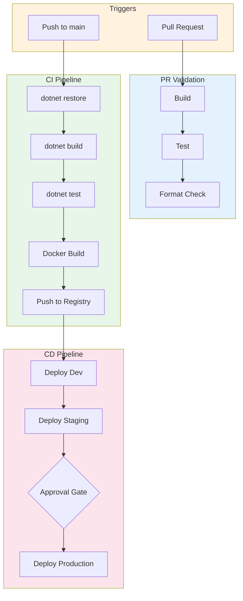
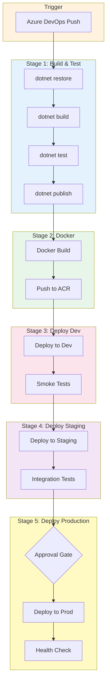
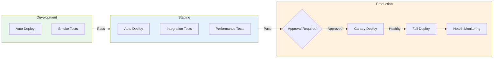

# CI/CD Pipeline Diagrams

## GitHub Actions Pipeline

```mermaid
graph TB
    subgraph Trigger["Triggers"]
        PR[Pull Request]
        Push[Push to main]
    end

    subgraph PR_Pipeline["PR Validation"]
        PR_Build[Build]
        PR_Test[Test]
        PR_Format[Format Check]
    end

    subgraph CI_Pipeline["CI Pipeline"]
        CI_Restore[dotnet restore]
        CI_Build[dotnet build]
        CI_Test[dotnet test]
        CI_Docker[Docker Build]
        CI_Push[Push to Registry]
    end

    subgraph CD_Pipeline["CD Pipeline"]
        CD_Dev[Deploy Dev]
        CD_Staging[Deploy Staging]
        CD_Approval{Approval Gate}
        CD_Prod[Deploy Production]
    end

    PR --> PR_Build
    PR_Build --> PR_Test
    PR_Test --> PR_Format

    Push --> CI_Restore
    CI_Restore --> CI_Build
    CI_Build --> CI_Test
    CI_Test --> CI_Docker
    CI_Docker --> CI_Push
    CI_Push --> CD_Dev
    CD_Dev --> CD_Staging
    CD_Staging --> CD_Approval
    CD_Approval --> CD_Prod

    style Trigger fill:#fff3e0
    style PR_Pipeline fill:#e3f2fd
    style CI_Pipeline fill:#e8f5e9
    style CD_Pipeline fill:#fce4ec
```

## Azure DevOps Pipeline

```mermaid
graph TB
    subgraph Trigger["Trigger"]
        ADO[Azure DevOps Push]
    end

    subgraph Stage1["Stage 1: Build & Test"]
        S1_Restore[dotnet restore]
        S1_Build[dotnet build]
        S1_Test[dotnet test]
        S1_Publish[dotnet publish]
    end

    subgraph Stage2["Stage 2: Docker"]
        S2_Build[Docker Build]
        S2_Push[Push to ACR]
    end

    subgraph Stage3["Stage 3: Deploy Dev"]
        S3_Deploy[Deploy to Dev]
        S3_Smoke[Smoke Tests]
    end

    subgraph Stage4["Stage 4: Deploy Staging"]
        S4_Deploy[Deploy to Staging]
        S4_Integration[Integration Tests]
    end

    subgraph Stage5["Stage 5: Deploy Production"]
        S5_Approval{Approval Gate}
        S5_Deploy[Deploy to Prod]
        S5_Health[Health Check]
    end

    ADO --> S1_Restore
    S1_Restore --> S1_Build
    S1_Build --> S1_Test
    S1_Test --> S1_Publish
    S1_Publish --> S2_Build
    S2_Build --> S2_Push
    S2_Push --> S3_Deploy
    S3_Deploy --> S3_Smoke
    S3_Smoke --> S4_Deploy
    S4_Deploy --> S4_Integration
    S4_Integration --> S5_Approval
    S5_Approval --> S5_Deploy
    S5_Deploy --> S5_Health

    style Trigger fill:#fff3e0
    style Stage1 fill:#e3f2fd
    style Stage2 fill:#e8f5e9
    style Stage3 fill:#fce4ec
    style Stage4 fill:#f3e5f5
    style Stage5 fill:#fff9c4
```

## Environment Promotion Strategy

```mermaid
graph LR
    subgraph Dev["Development"]
        D1[Auto Deploy]
        D2[Smoke Tests]
    end

    subgraph Staging["Staging"]
        S1[Auto Deploy]
        S2[Integration Tests]
        S3[Performance Tests]
    end

    subgraph Prod["Production"]
        P1{Approval Required}
        P2[Canary Deploy]
        P3[Full Deploy]
        P4[Health Monitoring]
    end

    Dev -->|Pass| Staging
    Staging -->|Pass| P1
    P1 -->|Approved| P2
    P2 -->|Healthy| P3
    P3 --> P4

    style Dev fill:#e8f5e9
    style Staging fill:#e3f2fd
    style Prod fill:#fff3e0
```
